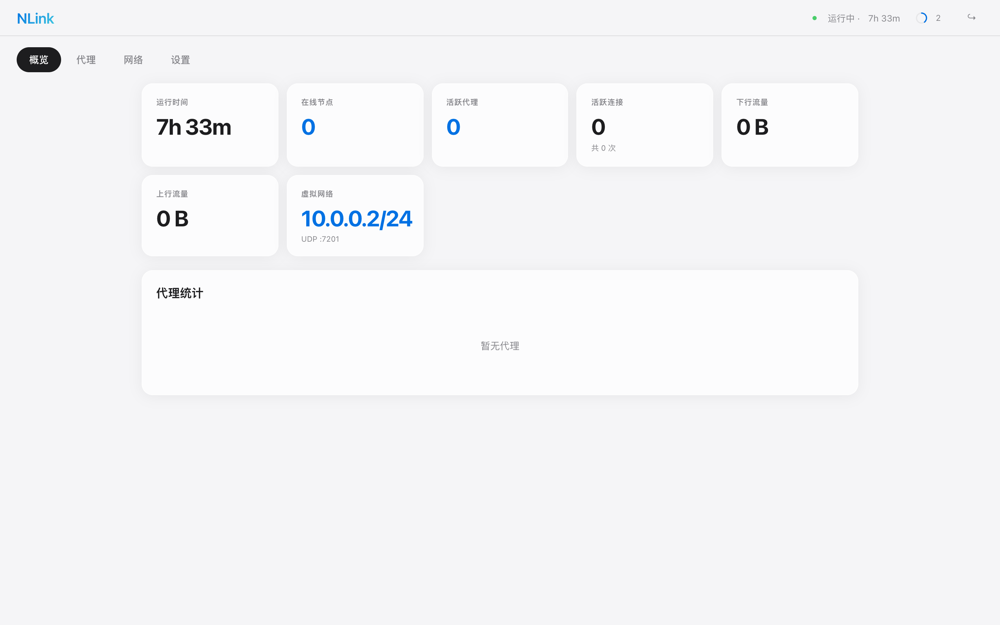
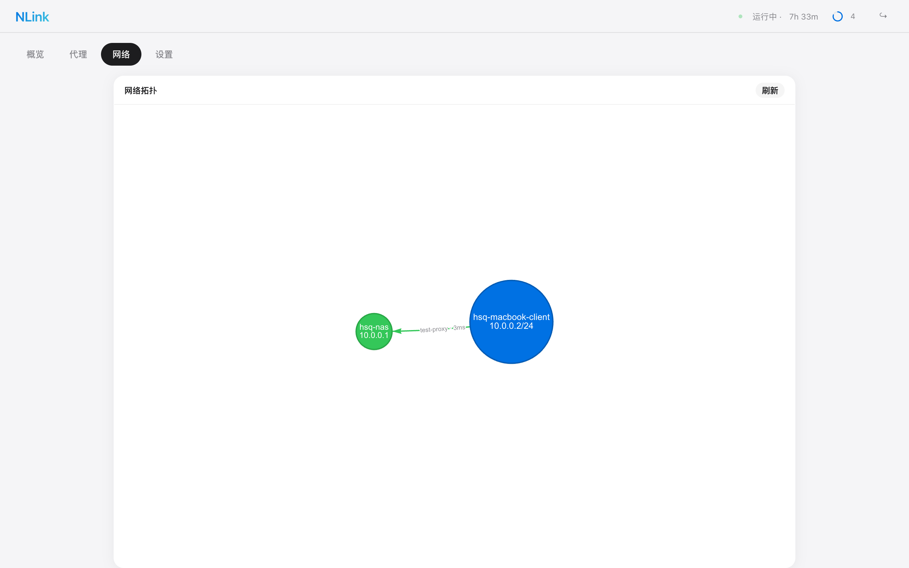

# NLink

[English](README_EN.md) | 中文

轻量级 P2P TCP 隧道工具。单二进制，配置驱动，每个实例既可以接受连接，也可以主动连接其他节点，也可以两者兼备作为中继。

## 截图

| 概览 | 网络拓扑 |
|------|---------|
|  |  |

## 特性

- **对等架构** — 没有固定的"服务端/客户端"，每个节点通过配置决定角色
- **单二进制** — 一个 `nlink` 解决所有场景
- **TCP 端口转发** — 将内网任意 TCP 服务映射到远程端口
- **虚拟局域网 (VPN)** — 基于 TUN + UDP 加密隧道的二层组网，节点间可直接互 ping
- **可视化 Dashboard** — 内置 Web 管理面板，vis-network 网络拓扑图，实时查看节点/代理/VPN 状态
- **连接池** — 预建工作连接，降低首次请求延迟
- **远程管理** — 通过 Dashboard 远程管理对端节点的代理、连接池
- **多级穿透** — 支持 A → B → C 链式转发，Dashboard 可跨级管理
- **自动重连** — 断线指数退避重连
- **心跳保活** — 自动检测节点在线状态
- **Token 认证** — 安全的节点接入验证（AES-256-GCM 加密）

## 原理

```
用户 ──▶ :9080 ──▶ Node-A(listen) ══隧道══▶ Node-B(peer) ──▶ 127.0.0.1:8080
```

```
VPN: Node-A (10.0.0.1) ◄──UDP加密──► Node-B (10.0.0.2)   互相 ping 通
```

每个节点可配置：

| 配置块 | 作用 |
|--------|------|
| `node.listen` | 接受其他节点连接（TCP 控制通道 + 工作连接） |
| `node.dashboard` | 启用 Web 管理面板 |
| `node.vpn` | 启用虚拟局域网（TUN + UDP 加密隧道） |
| `peers` | 主动连接其他节点并注册代理 |

## 安装

### 从 Release 下载

前往 [Releases](https://github.com/hsqbyte/nlink/releases) 下载对应平台的二进制文件。

### 从源码构建

```bash
git clone https://github.com/hsqbyte/nlink.git
cd nlink
go build -o nlink .
```

## 快速开始

### 节点 A — 公网机器，接受连接

```yaml
# config/nlink.yaml
node:
  name: "node-a"
  token: "your-secret"
  listen:
    port: 7000
    pool_count: 5
  dashboard:
    port: 18080
  vpn:
    enabled: true
    virtual_ip: "10.0.0.1/24"
    listen_port: 7200
```

### 节点 B — 内网机器，连接到 A

```yaml
# config/node-b.yaml
node:
  name: "node-b"
  token: "your-secret"
  dashboard:
    port: 18081
  vpn:
    enabled: true
    virtual_ip: "10.0.0.2/24"
    listen_port: 7201

peers:
  - addr: "x.x.x.x"
    port: 7000
    token: "your-secret"
    pool_count: 2
    vpn_port: 7200
    virtual_ip: "10.0.0.1"
    proxies:
      - name: "web"
        type: "tcp"
        local_ip: "127.0.0.1"
        local_port: 8080
        remote_port: 9080
```

### 启动

```bash
# 节点 A
nlink -c config/nlink.yaml

# 节点 B
nlink -c config/node-b.yaml
```

访问 `http://node-a:18080` 或 `http://node-b:18081` 查看 Dashboard。

外部用户访问 `node-a:9080` 即可到达 node-b 的 `127.0.0.1:8080`。

### VPN 虚拟网络

启动后，两个节点之间可以通过虚拟 IP 互相访问：

```bash
# 在 node-b 上 ping node-a 的虚拟 IP
ping 10.0.0.1

# 在 node-a 上 ping node-b 的虚拟 IP
ping 10.0.0.2
```

> **注意**：VPN 功能需要 root/sudo 权限来创建 TUN 设备。支持 macOS 和 Linux。

## CLI 参数

```
nlink [选项]

  -c string          配置文件路径 (默认 "config/nlink.yaml")
  -dashboard         强制启动管理面板 (即使配置中没有 dashboard)
  -dashboard-port    管理面板端口 (配合 -dashboard 使用，默认 18080)
```

## 完整配置参考

```yaml
node:
  name: "node-a"                    # 节点名称（唯一标识）
  token: "your-secret"              # 认证令牌

  listen:                           # 可选 — 接受其他节点连接
    port: 7000                      #   控制通道端口 (工作连接 = port+1)
    max_message_size: 65536         #   最大消息大小(字节)
    heartbeat_timeout: 90           #   心跳超时(秒)
    max_proxies_per_peer: 10        #   每对端最大代理数
    work_conn_timeout: 10           #   工作连接超时(秒)
    pool_count: 5                   #   全局连接池大小(0=禁用)

  dashboard:                        # 可选 — Web 管理面板
    enabled: true                   #   是否启用 (默认 true)
    port: 18080                     #   HTTP 端口
    shutdown_timeout: 30            #   优雅关闭超时(秒)
    username: "admin"               #   登录用户名 (留空则不启用认证)
    password: "admin"               #   登录密码
    tls_cert_file: "/path/cert.pem" #   TLS 证书 (配置后启用 HTTPS)
    tls_key_file: "/path/key.pem"   #   TLS 私钥

  vpn:                              # 可选 — 虚拟局域网
    enabled: true                   #   是否启用 (默认 false)
    virtual_ip: "10.0.0.1/24"      #   本节点虚拟 IP (CIDR)
    listen_port: 7200               #   UDP 监听端口
    mtu: 1400                       #   MTU (默认 1400)

peers:                              # 可选 — 主动连接的对端节点
  - addr: "192.168.1.100"
    port: 7000
    token: "your-secret"
    pool_count: 5
    vpn_port: 7200                  #   对端 VPN UDP 端口 (可选)
    virtual_ip: "10.0.0.1"         #   对端虚拟 IP (可选)
    proxies:
      - name: "web"
        type: "tcp"
        local_ip: "127.0.0.1"
        local_port: 8080
        remote_port: 9080
```

## API

| 方法 | 路径 | 说明 |
|------|------|------|
| GET | /api/v1/stats | Dashboard 统计数据 |
| GET | /api/v1/proxies | 列出所有代理 |
| GET | /api/v1/peers | 列出在线对端 |
| GET | /api/v1/status | 节点状态 |
| GET | /api/v1/node/config | 获取节点配置 |
| PUT | /api/v1/node/config | 热更新配置 |
| DELETE | /api/v1/peers/:name | 踢出对端 |
| GET | /api/v1/peers/:name/config | 获取对端配置 |
| POST | /api/v1/peers/:name/proxies | 远程添加代理 |
| DELETE | /api/v1/peers/:name/proxies/:proxy | 远程删除代理 |
| PUT | /api/v1/peers/:name/pool | 修改对端连接池 |

## 许可证

[GPL-3.0](LICENSE)
